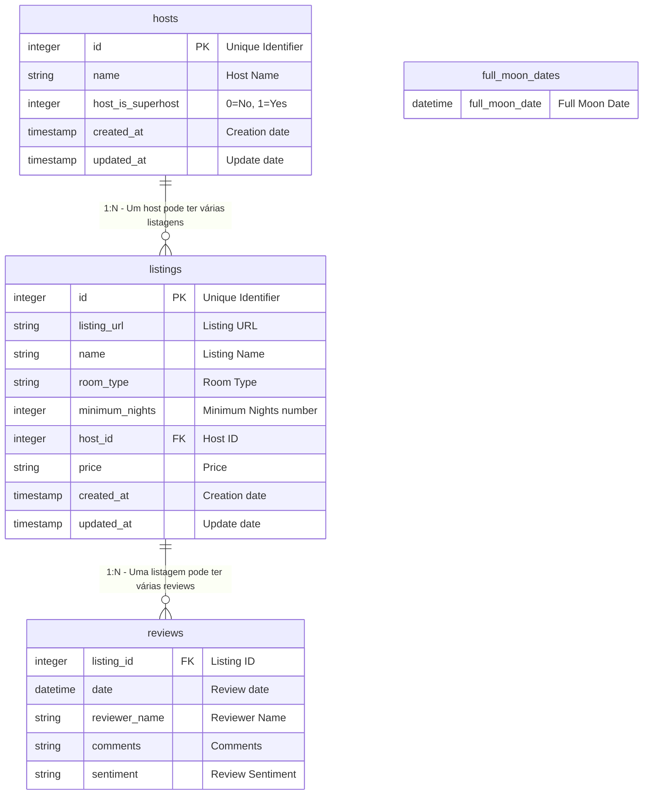

# Entropia - Airbnb Listings and Reviews

Project created during the [The Complete dbt (Data Build Tool) Bootcamp: Zero to Hero](https://www.udemy.com/course/complete-dbt-data-build-tool-bootcamp-zero-to-hero-learn-dbt/), by [Zoltan C. Toth](https://www.linkedin.com/in/zoltanctoth/).

This repository is the result of my learnings while following every training step.

The Entropia Project is compound of two main folders:

* `airbnb` - The dbt project.
* `dagster_entropia` - The Dagster application.

### Running up the applications

Instructions for the `venv`.

dbt project

```text
cd entropia/airbnb/
```

```shell
$entropia/airbnb %
```

Dagster application

```text
cd entropia/dagster_entropia/
```

```shell
$entropia/dagster_entropia % dagster dev
```

It will open the localhost Dagster application on port 3000.

http://127.0.0.1:3000


## Roadmap

### Phase 1
- [ ] Separate the dev, stage and prod environments.
- [ ] Utilize the GitHub Actions to deploy from the dev into stage and prod environments.
- [ ] Deploy the entropia project to a Cloud Provider. It means the dbt project and the Dagster application. It might be Google Cloud Platform or AWS.
- [ ] Establish the routine to run the dbt materializations and tests through the Dagster application.

While doing these steps, take notes of all learnings related to dbt, Dagster, Snowflake, GitHub Actions and the chosen Cloud provider.


## Tables and Relationships

### Table: `listings`


| Column | Type | Description |
|-------|------|-----------|
| id | integer | Unique Identifier (PK) |
| listing_url | string | Listing URL |
| name | string | Listing name |
| room_type | string | Room Type |
| minimum_nights | integer | Minimum Nights number |
| host_id | integer | Host ID (FK → hosts) |
| price | string | Price |
| created_at | timestamp | Creation date |
| updated_at | timestamp | Update date |

---

### Table: `reviews`


| Column | Type | Description |
|-------|------|-----------|
| listing_id | integer | Listing ID (FK → listings) |
| date | datetime | Review date |
| reviewer_name | string | Reviewer Name |
| comments | string | Comments |
| sentiment | string | Review Sentiment |

---

### Table: `hosts`


| Column | Type | Description |
|-------|------|-----------|
| id | integer | Unique Identifier  (PK) |
| name | string | Host Name |
| host_is_superhost | string | Is superhost or not |
| created_at | timestamp | Creation date |
| updated_at | timestamp | Update date |

---

### Table: `full_moon_dates`

| Column | Type | Description |
|-------|------|-----------|
| full_moon_date | datetime | Full Moon Date |

---

## Relationships



### Relationships descriptions:

1. **hosts → listings**: A host can have multiple listings (1:N)
   - Foreign key: `listings.host_id` references `hosts.id`

2. **listings → reviews**: A listing can have multiple reviews (1:N)
   - Foreign key: `reviews.listing_id` references `listings.id`

3. **full_moon_dates**: Independent table with no direct relationships

---
