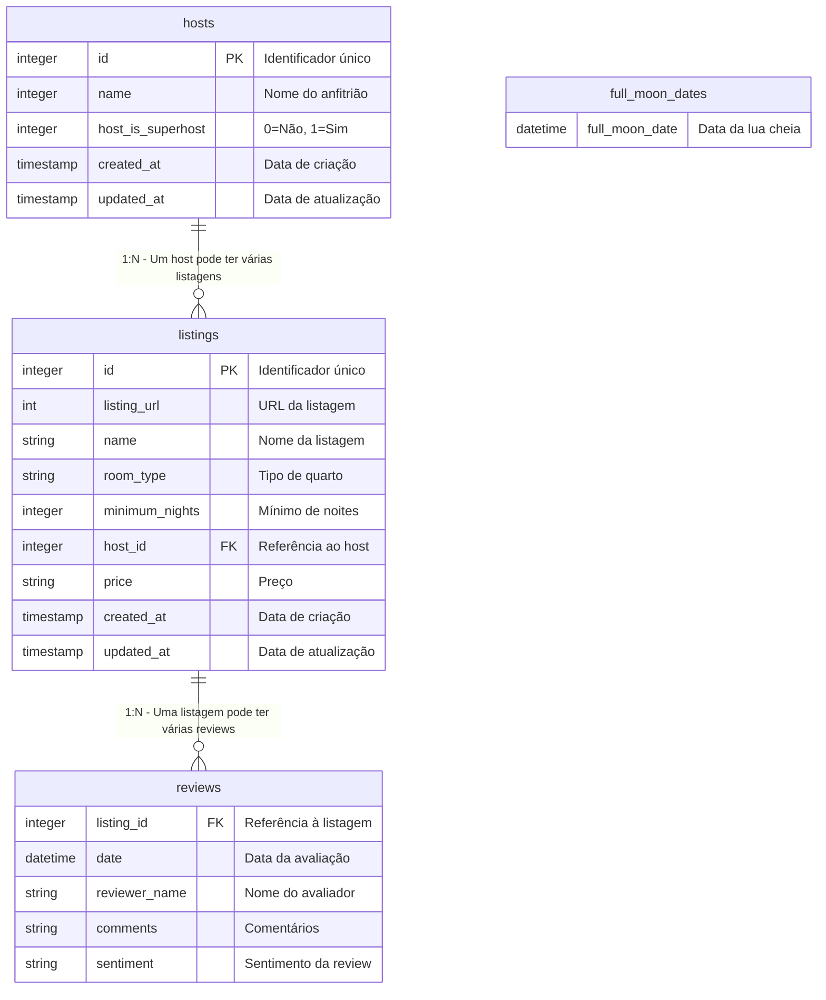

# Data Modeling - Airbnb Listings and Reviews

## Tables and Relationships

### Table: `listings`

| Column | Type | Description |
|-------|------|-----------|
| id | integer | Identificador único (PK) |
| listing_url | int | URL da listagem |
| name | string | Nome da listagem |
| room_type | string | Tipo de quarto |
| minimum_nights | integer | Número mínimo de noites |
| host_id | integer | ID do anfitrião (FK → hosts) |
| price | string | Preço |
| created_at | timestamp | Data de criação |
| updated_at | timestamp | Data de atualização |

---

### Table: `reviews`

| Column | Type | Description |
|-------|------|-----------|
| listing_id | integer | ID da listagem (FK → listings) |
| date | datetime | Data da avaliação |
| reviewer_name | string | Nome do avaliador |
| comments | string | Comentários |
| sentiment | string | Sentimento da avaliação |

---

### Table: `hosts`

| Column | Type | Description |
|-------|------|-----------|
| id | integer | Identificador único (PK) |
| name | integer | Nome do anfitrião |
| host_is_superhost | integer | Indica se é superhost |
| created_at | timestamp | Data de criação |
| updated_at | timestamp | Data de atualização |

---

### Table: `full_moon_dates`

| Column | Type | Description |
|-------|------|-----------|
| full_moon_date | datetime | Full Moon Date |

---

## Relacionamentos

### Descrição dos Relacionamentos:

1. **hosts → listings**: Um anfitrião pode ter várias listagens (1:N)
   - Chave estrangeira: `listings.host_id` referencia `hosts.id`

2. **listings → reviews**: Uma listagem pode ter várias avaliações (1:N)
   - Chave estrangeira: `reviews.listing_id` referencia `listings.id`

3. **full_moon_dates**: Tabela independente sem relacionamentos diretos

---
